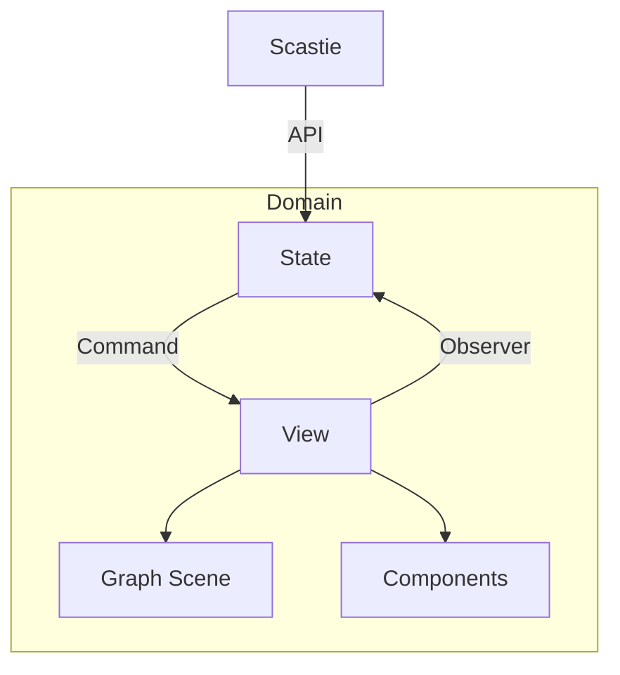
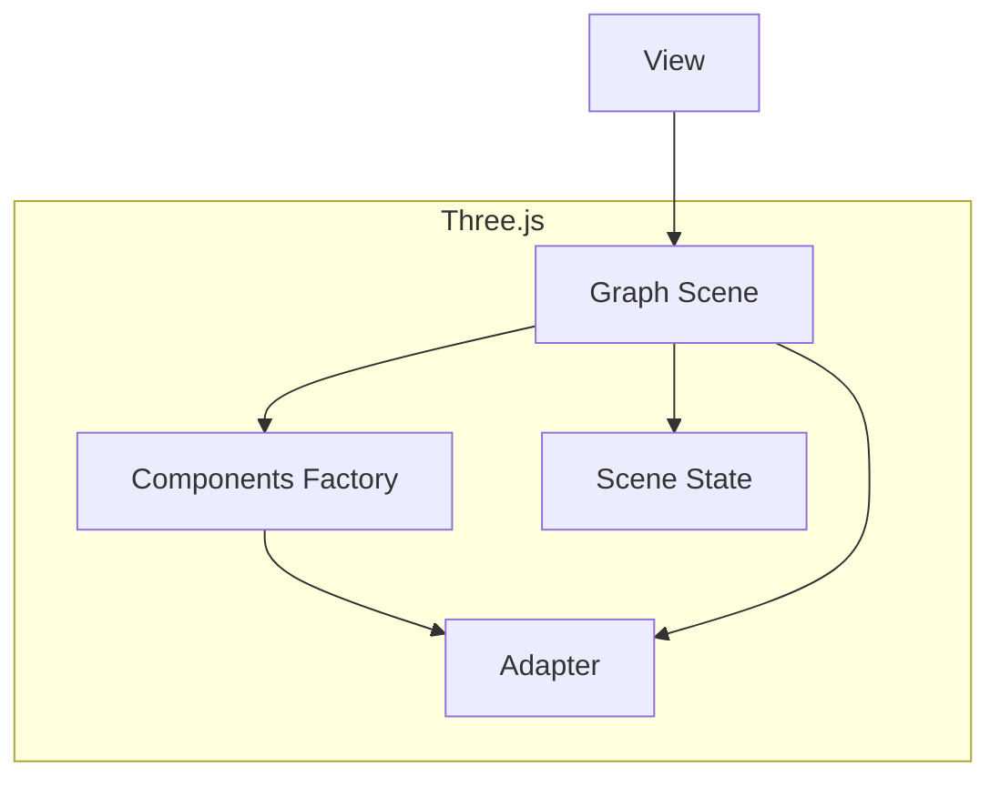

# Architettura

## Livelli

- **Domain**: Contiene la logica di business e i concetti fondamentali del sistema. È la parte dell’applicazione, priva di dipendenze da framework o librerie specifiche e comune a tutto il progetto. All'interno sono modellate le entità e i comandi applicabili su di esse. Il codice di questo livello è usato da tutta l'applicazione.

- **State**: Si occupa di gestire lo stato dell’applicazione e le sue transizioni. Contiene il meccanismo che tiene traccia delle modifiche al dominio ed espone operazioni per aggiornare lo stato.

- **View**: Si basa su un design a componenti, ovvero su piccoli moduli (UI Components) che si occupano ciascuno di una parte di interfaccia. Gestisce la presentazione dei dati e l’interazione con l’utente.

- **Graph**: Si occupa di gestire la visualizzazione del grafo 3D. Include la logica per la rappresentazione e la manipolazione del grafo, e la comunicazione con la libreria Three.js.

## Architettura Generale

Dal diagramma si può notare come il modulo generato da Scastie non presenta alcuna dipendenza e comunica con l'applicativo tramite API. Questo permette di mantenere l'applicativo indipendente da Scastie e di sostituire facilmente il modulo con un'altra implementazione.

## Architettura del Grafo 3D

La gestione del grafo 3D è da considerarsi totalmente separata dal resto dell'applicazione, tanto da avere un proprio stato privato ed un proprio sistema di componenti. L'architettura del grafo 3D è fortemente influenzata dalla libreria Three.js rendendo quest' ultima una dipendenza forte dell'intero modulo Graph.

## Principali Pattenr Architetturali

- **Component-Based Design**: La View è organizzata in componenti riutilizzabili, ognuno responsabile di un aspetto specifico dell’interfaccia. Questo semplifica la manutenzione e promuove la riusabilità.

- **Adapter Pattern**: Utilizzato principalmente nella Graph Infrastructure per adattare librerie o API esterne al modello e alle interfacce dell’applicazione, mantenendo l’applicazione (Domain/State/View) indipendente dai dettagli di implementazione.

- **Observer Pattern**: Utilizzato per notificare i cambiamenti di stato ai componenti interessati, garantendo la coerenza tra le diverse parti dell’applicazione.

- **Command Pattern**: Utilizzato per incapsulare le richieste di modifica dello stato in oggetti, permettendo di parametrizzare le operazioni e di gestire le transazioni in modo flessibile.
