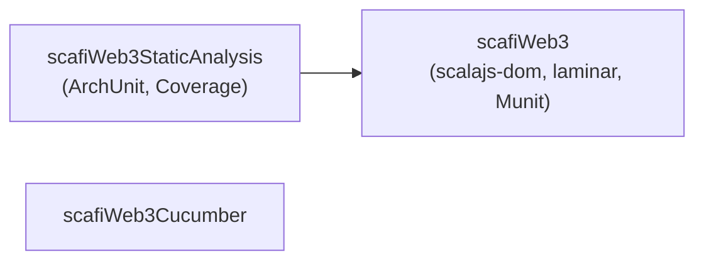

# Testing

Durante le prime fasi di sviluppo del progetto, i test non sono stati usati, poiché l'obiettivo principale era fare uno studio di fattibilità del progetto. Tuttavia, per garantire la correttezza delle funzionalità implementate, una volta ottenuto il prototipo, è stato adottato fin da subito un approccio **Test-Driven Development (TDD)** utilizzando [MUnit](https://scalameta.org/munit/) assieme a [ScalaCheck](https://scalameta.org/munit/docs/integrations/scalacheck.html). Successivamente, raggiunta una versione stabile del progetto, si è adottato l'approccio **Behavior-Driven Development (BDD)** impiegando [Cucumber](https://cucumber.io/) integrato con [Selenium](https://www.selenium.dev/). Inloco, per garantire la correttezza dell'architettura, sono stati implementati dei test d'architettura utilizzando [ArchUnit](https://www.archunit.org/), e la coverage dei test è stata monitorata tramite [sbt-scoverage](https://github.com/scoverage/sbt-scoverage).

## Struttura dei test

L'architettura dei test è stata progettata per prevenire errori legati al [linker di Scala.js](https://www.scala-js.org/doc/project/linking-errors.html).



### Differenza tra Test Scala.js e Test JVM

I **test Scala.js** e i **test JVM** differiscono principalmente nell’ambiente di esecuzione e nelle dipendenze di runtime:

1. **Test Scala.js**  
   - Richiedono il supporto del **plugin Scala.js**.
   - Utilizzano librerie specifiche per l’ambiente JavaScript, come `scalajs-dom` per interagire con il DOM o `upickle` per la serializzazione JSON.  

2. **Test JVM**  
   - Sono eseguiti direttamente sulla JVM, senza alcuna necessità del plugin Scala.js.  
   - Non richiedono alcuna conversione in JavaScript e possono sfruttare direttamente le librerie del mondo Java.
   - Possono essere eseguiti con normali strumenti di test Scala come `MUnit`, `ScalaTest` o `JUnit`, senza preoccuparsi di compatibilità con l’ecosistema JavaScript.  

### Implicazioni nella Progettazione dei Test

Dato che i test Scala.js non possono essere eseguiti direttamente su una JVM, la suddivisione tra i due ambienti di test è fondamentale per evitare errori di collegamento. In particolare:

- I **test Scala.js** vengono eseguiti in un ambiente separato, per evitare problemi di compatibilità.
- I **test JVM** possono essere eseguiti indipendentemente dalla presenza o meno del plugin di Scala.js, garantendo una maggiore flessibilità.

In particolare fare questa distinzione ha permesso di utilizzare al `scoverage` e `ArchUnit` che non possono essere eseguiti in un ambiente Scala.js.

::: info
La coverage viene calcolata solo sui package `domain` e i parser in `api`, poiché sono gli unici moduli che non dipendono in alcun modo da Scala.js.
:::

## MUnit

Di seguito un esempio di test (MUnit e ScalaCheck):

```scala
test("addNode should add a node to the state") {
  forAll {
    (id: Int, label: String, color: Int, x: Double, y: Double, z: Double) =>
      val node: Set[GraphNode] =
        Set(GraphNode(id, Position(x, y, z), label, color))
      GraphState.commandObserver.onNext(SetNodes(node))
      val result: Set[GraphNode] = GraphState.nodes.now()
      result == node
  }
}
```

## Cucumber

```gherkin
Feature: Unit Test Feature
@unit
Scenario Outline: Unit Test Scenario
    Then The unit tests called "<testName>" should pass
    Examples:
    | testName                 |
    | state.AnimationStateSpec |
    | state.GraphStateSpec     |
    | api.NodeParserSpec       |
    | api.EdgeParserSpec       |
```

L'idea alla base del codice di seguito consiste nel creare uno step di Cucumber che esegua i test specificati in testName e verifichi che il loro valore di uscita sia pari a 0, indicando che i test sono stati superati con successo. Questo approccio mira a fornire una conferma chiara al cliente che i test siano passati e che il codice sia funzionante. Utilizzare direttamente Cucumber per testare il codice è un'idea che potrebbe essere valutata in futuro, ma attualmente presenta alcune problematiche che ne riducono l'efficienza. Nello specifico, questo metodo introduce diverse viscosità e rende il processo di sviluppo tramite TDD significativamente più lento. Per queste ragioni, si è preferito adottare l'approccio descritto sopra, che permette una verifica più rapida e diretta del codice.

```scala
class UnitTestWrapper extends ScalaDsl with EN:
  Then("The unit tests called {string} should pass") { (testName: String) =>
    val command   = s"sbt \"testOnly $testName\""
    val exitValue = command.!
    assert(exitValue == 0, "Test execution failed")
  }
```

D'altra parte l'approccio BDD è stato adottato per testare l'interfaccia grafica e le funzionalità dell'applicazione. In questo caso, Cucumber è stato utilizzato per definire i test e Selenium per simulare le interazioni utente. Questo approccio è stato scelto per garantire che l'applicazione soddisfi i requisiti funzionali e che le funzionalità siano implementate correttamente.

```gherkin
@web
Scenario: High Update Rate Support
    Given I am on the Scafi Web Page
    Then the engine "EngineImpl" is loaded
    Then the graph 10x10x2 should support more than "30" updates per second
```

### Cucumber - CI/CD

Purtroppo alcuni test cucumber devono per forza essere eseguiti in un ambiente grafico, quindi non possono essere eseguiti in un ambiente headless. Le github actions non supportano l'ambiente grafico, quindi non è possibile eseguire alcuni test cucumber in CI/CD. Per ovviare a questo problema, sono stati creati dei [comandi personalizzati](../introduction.md) tramite sbt.

## ArchUnit

Sono stati inoltre implementati dei test d'architettura per mezzo di ArchUnit, che verificano per esempio che il dominio non abbia alcuna dipendenza estera e che lo stato dipenda solo la laminar ed il dominio.

```scala
noDependTest(
  testName =
    "Domain package should only depend on itself and standard libraries",
  importRoot = "domain..",
  packageToCheck = "..domain..",
  forbiddenPackages = Seq("..laminar..", "..state..", "..js.."),
  becauseMsg =
    "Domain layer should be isolated from infrastructure and application layers"
  )
```
